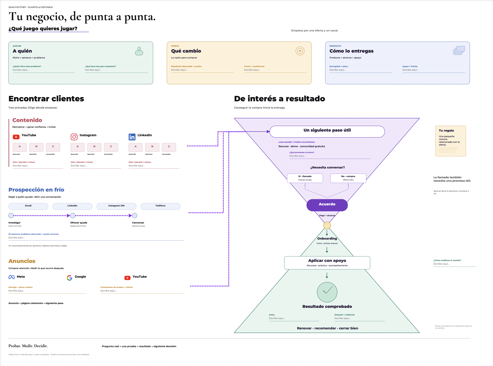

# sfmap

Un lienzo nativo para macOS: piensa, dibuja y organiza tu negocio con texto, imágenes, conectores y zoom. Tus mapas se guardan en tu Mac; no necesitas una cuenta ni configurar un servidor.



## Empieza aquí

1. **[Descarga sfmap para Mac con Apple Silicon](https://github.com/saas-factory-community/sfmap/releases/tag/v0.2.0)**. Requiere macOS 15 o posterior.
2. Descomprime el paquete y arrastra `sfmap.app` a **Aplicaciones**.
3. Abre la app. En el engrane, elige **Importar .sfmap…** y selecciona `Tu-negocio.sfmap`, incluido en la descarga.
4. Acércate con **⌘ + rueda**, edita un texto con **doble clic** y haz tuyo el mapa.

**Versión de evaluación:** el binario tiene firma local, pero todavía no tiene Developer ID ni notarización de Apple. macOS puede mostrar una advertencia o bloquear la primera apertura. Consulta la [guía de instalación](docs/instalacion.md), que también incluye la opción de compilar desde el código.

## Qué trae esta versión

- **Biblioteca local** con lienzos y carpetas. Guardado automático e historial de deshacer durante la sesión.
- **Plantillas `.sfmap`** editables, con imágenes incluidas. Importar crea una página nueva; tu original se conserva.
- **Editor visual:** texto enriquecido, formas, flechas, imágenes, lápiz y marcador; agrupación, capas, bloqueo y recorte.
- **Ajustes de lectura:** minimapa, documentos desactivados por defecto, tema del sistema/claro/oscuro y fondo liso/puntos/cuadrícula.
- **Navegación por zoom** y enlaces entre elementos. Barra inferior compacta con estado indicado por color.
- **HTML y documentos locales** para usos avanzados dentro del editor. Los elementos HTML y los widgets conectados aún no se exportan al formato portátil.

### Tu negocio, de punta a punta

La [plantilla incluida](templates/tu-negocio) reúne cliente, oferta, producto, canales y recorrido de entrega. Tiene **200 elementos nativos editables**. Completa primero **A quién**, **Qué cambio** y **Cómo lo entregas**; después elige un canal de adquisición.

[Descargar solo la plantilla](https://github.com/saas-factory-community/sfmap/releases/download/v0.2.0/Tu-negocio.sfmap) · [Cómo utilizarla](templates/tu-negocio/README.md)

## Controles esenciales

| Acción | Control |
| --- | --- |
| Mover el lienzo | Rueda / dos dedos; espacio + arrastrar |
| Acercar / alejar | ⌘ + rueda |
| Encuadrar contenido | ⇧1 |
| Volver al 100% | 0 |
| Editar texto | Doble clic / Intro |
| Seleccionar / nota / texto | V / N / L |
| Rectángulo / círculo / conector | R / O / C |
| Lápiz / marcador / goma | P / M / E |
| Deshacer / rehacer | ⌘Z / ⇧⌘Z |
| Cambiar tema | T |
| Compartir copia editable | Engrane → Descargar lienzo… |
| Ver todos los atajos | ⌘/ |

Tus archivos viven en `~/Library/Application Support/sfmap/Biblioteca`. La biblioteca local no se sincroniza sola entre Macs. Para compartir, exporta un `.sfmap`; para respaldo, conserva también la carpeta `Imagenes` junto a `Biblioteca`.

## Compilar desde el código

Necesitas macOS 15+ y herramientas de desarrollo con **Swift 6**:

```bash
git clone https://github.com/saas-factory-community/sfmap.git
cd sfmap
swift run SFMap --local
```

Para probar el código: `swift test`. Para producir una `.app` con una identidad de firma estable propia:

```bash
SFMAP_IDENTITY="Nombre de tu certificado" bash scripts/package.sh --no-install
```

El resultado queda en `dist/sfmap.app`. Sin `--no-install`, el script instala en `~/Applications` y conserva la versión anterior en `dist/previous`. No crea firmas ad hoc ni incluye credenciales.

## Más información

- [Instalación, respaldo y solución de problemas](docs/instalacion.md)
- [Formato portátil y comandos](docs/portabilidad.md)
- [Nube e integraciones opcionales](docs/integraciones.md)
- [Cambios de la versión](CHANGELOG.md)

Hecho para la comunidad [SaaS Factory](https://saasfactory.so).
