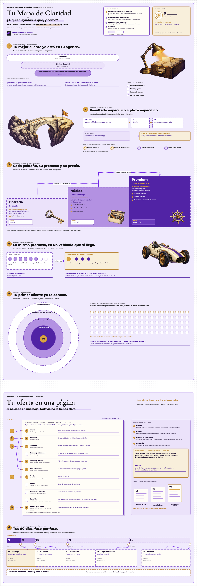

# Mapa de Claridad · Arbrain

**[Descarga Mapa-de-Claridad.sfmap](https://github.com/saas-factory-community/sfmap/releases/download/v0.3.0/Mapa-de-Claridad.sfmap)** y ábrelo desde sfmap → engrane → **Importar .sfmap…**.

El entregable de las dos primeras semanas del programa: **F0 · Tu mapa** y **F1 · Tu oferta en una página**.
Es un lienzo editable, no una captura: texto, formas, conectores e imágenes se pueden mover y reescribir.

## Cómo se lee

- **Capítulo 1 · Tu mapa.** Cinco piezas con número dorado: ① a quién ayudas, ② tu promesa,
  ③ tu escalera de oferta, ④ tu vehículo y ⑤ tu red caliente.
- **Capítulo 2 · Tu oferta en una página.** Los mismos números dorados caen en su renglón de la hoja;
  los renglones punteados se deciden ahí. Al lado, las reglas de la hoja y tu gran ficha.
- **⑥ Tus 90 días**, dibujados a escala de días, con una tarjeta y una fecha por fase.

## Cómo se llena

Lo escrito en violeta es el ejemplo de **Ana, consultora ficticia que ayuda a clínicas dentales**.
Doble clic y reemplázalo por lo tuyo. «Escribe aquí…» espera tu respuesta. Punteado = por construir;
sólido = ya existe. Ninguna cifra del ejemplo es un resultado real ni una promesa de ingresos.

Las ilustraciones fueron generadas para esta plantilla y viajan dentro del archivo.
